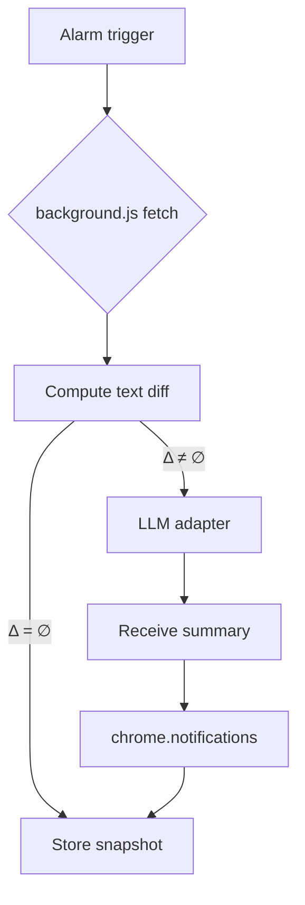

# Google‑Style PRD · Page Change Notifier Chrome Extension

## Document Control

| Section          | Detail                        |
| ---------------- | ----------------------------- |
| **Author**       | ChatGPT (on behalf of Victor) |
| **Last updated** | 2025‑06‑13                    |
| **Status**       | Draft v0.1 — awaiting review  |

---

## 1. Background & Motivation

YC’s AI‑SUS event page (and similar sites) frequently update with new session links and venue details. Manually refreshing risks missing key changes. A lightweight Chrome extension can poll the page, detect meaningful diffs, condense them via an LLM, and proactively alert the user via native notifications. The same mechanic can monitor any URL the user specifies.

---

## 2. Goals

1. **Detect content changes** on a single, user‑defined URL (default: `https://events.ycombinator.com/ai-sus`).
2. **Summarize changes** using an LLM with a user‑editable prompt (default: “Tell me the important changes in 2 sentences”). If no LLM is configured, surface the raw diff.
3. **Notify the user** with a Chrome notification that includes the summary (or diff) and links back to the page.
4. **Provide intuitive controls** via a popup UI to configure URL, polling cadence, prompt text, and LLM provider/API key.
5. **Enable local testing** with sample pages and scripts so contributors can verify diff/notification flow offline.

---

## 3. Non‑Goals

* Multi‑URL monitoring or complex scheduling logic (future work).
* Full visual diffing or CSS/JS change detection — scope is text content only.
* Server‑side storage; all data is local to the browser.

---

## 4. Success Metrics

| Metric                         | Target                                                  |
| ------------------------------ | ------------------------------------------------------- |
| Setup friction                 | < 3 clicks to start monitoring default URL              |
| Change‑to‑notification latency | ≤ 30 s beyond polling cadence                           |
| False‑positive rate            | < 5 % of notifications deemed “noise” in dog‑food tests |
| Extension size                 | < 200 KB zipped (excluding icons)                       |

---

## 5. User Stories

1. **Victor** installs the extension, leaves default URL & prompt, and receives a concise summary whenever YC updates event details.
2. **Grace** changes the URL to her university LMS announcements page, sets cadence to 1 min, and uses “Give me bullet points” prompt to stay updated while studying.
3. **Dev** sets LLM provider to “No LLM” when offline; they still get raw diffs until connectivity/API key is restored.

---

## 6. Requirements

### 6.1 Functional

| #    | Requirement                                                                                                                                                                                                                              | Priority |
| ---- | ---------------------------------------------------------------------------------------------------------------------------------------------------------------------------------------------------------------------------------------- | -------- |
| F‑1  | Poll target URL every *N* minutes (default = 5; user‑adjustable 1–15)                                                                                                                                                                    | P0       |
| F‑2  | Compute text diff between last and current fetch<br>• **Pre‑filter:** lightweight SimHash on page text (treat change insignificant if Hamming distance ≤ 3)<br>• **Diff:** semantic HTML diff via `htmldiff-js`, then strip tags for LLM | P0       |
| F‑3  | If diff ≠ ∅, send to selected LLM adapter with user prompt; else bypass                                                                                                                                                                  | P0       |
| F‑4  | Show Chrome notification with LLM response (or diff) and “Open page” link                                                                                                                                                                | P0       |
| F‑5  | Popup UI allows editing URL, polling slider, prompt textarea, LLM provider radio group, API‑key input (masked)                                                                                                                           | P0       |
| F‑6  | Clicking extension icon opens (or switches to) the target tab; if URL changed, load new tab                                                                                                                                              | P0       |
| F‑7  | Store settings & last snapshot in `chrome.storage.local`                                                                                                                                                                                 | P0       |
| F‑8  | Support providers: **No LLM**, **OpenAI**, **Google Gemini**, **Chrome Prompt API**                                                                                                                                                      | P0       |
| F‑9  | Validate and persist provider‑specific API keys locally only                                                                                                                                                                             | P1       |
| F‑10 | Expose “Test now” button in popup to force immediate diff check                                                                                                                                                                          | P1       |

### 6.2 Non‑Functional

* **Privacy**: No data leaves the device except direct LLM API calls initiated by the user’s key.
* **Performance**: Snapshot + diff under 300 ms for a 1 MB HTML file on mid‑range laptop.
* **Reliability**: Graceful degradation when LLM call fails (fallback to diff).

---

## 7. UX / UI

### 7.1 Popup Layout

```
┌───────────────────────────────────────────┐
│  🔔 Page Change Notifier                 │
├───────────────────────────────────────────┤
│ Target URL                               │
│ [ https://events.ycombinator.com/ai-sus ]│
│                                           │
│ Polling cadence:  1 min ───▐▌────── 15 min│
│                                           │
│ Prompt                                    │
│ [ Tell me the important changes …   ]     │
│                                           │
│ LLM Provider                              │
│ (•) No LLM  ( ) OpenAI  ( ) Gemini  ( ) Chrome│
│ API key: [ *************** ]              │
│                                           │
│ [ Save ]     [ Test now ]                 │
└───────────────────────────────────────────┘
```

* **Slider**: HTML `<input type="range" min=1 max=15 step=1>`.
* **API key field** hidden unless provider requires it.

### 7.2 Notifications

* **Title**: “📰 Update detected on {hostname}”
* **Body**: First \~180 chars of LLM summary/diff.
* **Buttons**: “Open page” (focuses tab)

---

## 8. Technical Design

### 8.1 Components

| Component                             | Role                                                                                          |
| ------------------------------------- | --------------------------------------------------------------------------------------------- |
| **background.js (Service Worker)**    | Sets `chrome.alarms`, fetches page, diffs snapshots, invokes LLM adapter, shows notifications |
| **popup.js / popup.html / popup.css** | Renders UI, reads/writes settings, fires immediate check                                      |
| **utils/diff.js**                     | SimHash pre‑filter + `htmldiff-js` semantic diff utility                                      |
| **llm/**                              | `openai.js`, `gemini.js`, `chromePrompt.js`, each exposing `async summarize(diff, prompt)`    |
| **manifest.json v3**                  | Declares permissions: `storage`, `alarms`, `notifications`, `tabs`, host for `*://*/*`        |

### 8.2 Data Flow



### 8.3 Diff Algorithm

````js
import htmldiff from 'htmldiff-js';
import simhash from 'simhash';

function textFromHtml(html) {
  const tmp = document.createElement('div');
  tmp.innerHTML = html;
  return tmp.innerText;
}

export async function computeDiff(prevHtml, newHtml) {
  const prevHash = simhash(textFromHtml(prevHtml));
  const newHash  = simhash(textFromHtml(newHtml));
  if (prevHash.distance(newHash) <= 3) return null; // no meaningful change

  const htmlDelta = htmldiff(prevHtml, newHtml);
  return textFromHtml(htmlDelta); // cleaned diff for LLM
}
```js
import { diffWordsWithSpace } from 'diff';
const diff = diffWordsWithSpace(oldText, newText)
  .filter(p => p.added || p.removed)
  .map(p => (p.added ? '+ ' : '- ') + p.value)
  .join('');
````

### 8.4 LLM Adapters

| Provider             | Endpoint                                                                                          | Request Shape                                                         |
| -------------------- | ------------------------------------------------------------------------------------------------- | --------------------------------------------------------------------- |
| OpenAI               | `POST https://api.openai.com/v1/chat/completions`                                                 | `{model, messages:[{role:'user', content:`\${prompt}\n\n\${diff}`}]}` |
| Gemini               | `POST https://generativelanguage.googleapis.com/v1/models/gemini-pro:generateContent?key=API_KEY` | Similar JSON body                                                     |
| Chrome AI Prompt API | `chrome.ai.prompt()` (see docs)                                                                   |                                                                       |

### 8.5 Storage Keys

```json
{
  "url": "https://events.ycombinator.com/ai-sus",
  "cadence": 5,
  "prompt": "Tell me the important changes in 2 sentences",
  "provider": "no-llm",    // or "openai" | "gemini" | "chrome"
  "apiKey": "sk-...",
  "snapshot": "<last text>"
}
```

---

## 9. Test & Dev Environment

### 9.1 Auto‑Mutating Dev Server

A helper Express server auto‑updates page content so manual file swaps aren’t needed.

**Files**

```
dev-server.js    – serves /page with dynamic span, bumping counter every 120 s
/static/v1       – fixed baseline HTML for regression tests
```

Start server:

```bash
npm run dev   # node dev-server.js (alias in package.json)
```

Visit `http://localhost:8080/page`, set as target URL, and watch notifications fire on each automated update.

### 9.2 Quick‑start

```bash
git clone https://github.com/<repo>/page-change-notifier.git
cd page-change-notifier
npm install
npm run build      # copies src → dist/
```

1. Visit `chrome://extensions` → **Load unpacked** → select `dist/`.
2. Click extension icon → **Save** to start monitoring default URL.
3. Use **Test now** to trigger a manual check during development.

### 9.3 Automated Tests

* Jest + jsdom to unit‑test diff utility.
* Mock fetch & adapters to verify notification payloads.

---

## 10. Roll‑out & Future Work

* **v0.2** – multi‑URL support, per‑URL cadence.
* **v0.3** – visual diff view in a new tab.
* **v0.4** – notification batching & daily digest.

---

## 11. Open Issues

1. Chrome Manifest V3 service‑worker lifespan may delay long polls >15 min; current cadence (≤15 min) is safe.
2. Chrome Prompt API availability is limited to Canary at time of writing — handle gracefully.
3. Privacy messaging in store listing TBD.

---

## Appendix · References

* `jsdiff` – [https://www.npmjs.com/package/diff](https://www.npmjs.com/package/diff)
* Chrome Prompt API – [https://developer.chrome.com/docs/ai/prompt-api](https://developer.chrome.com/docs/ai/prompt-api)
* OpenAI API reference – [https://platform.openai.com/docs/api-reference](https://platform.openai.com/docs/api-reference)
* Google Gemini API – [https://ai.google.dev/docs/api/rest](https://ai.google.dev/docs/api/rest)
